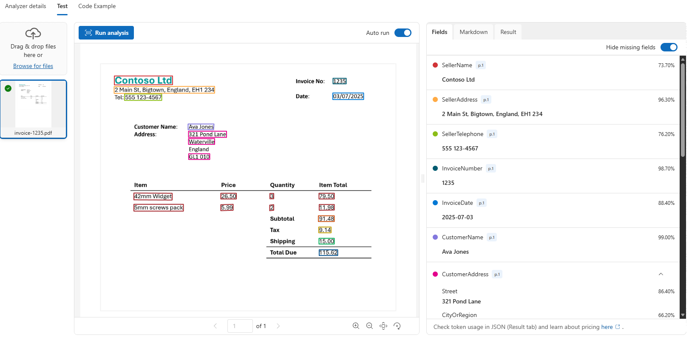
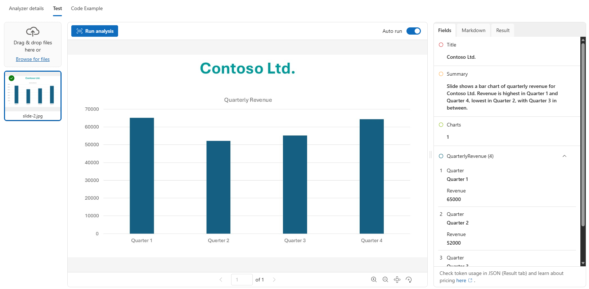
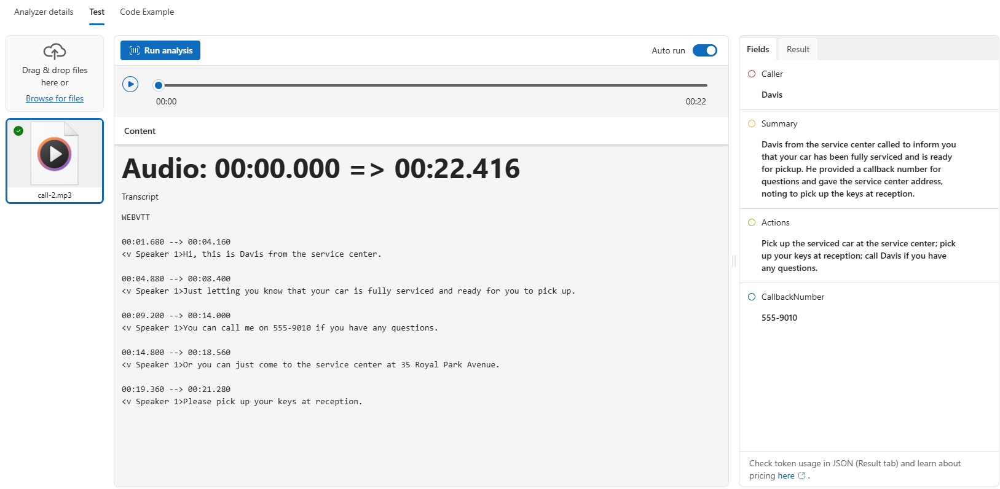
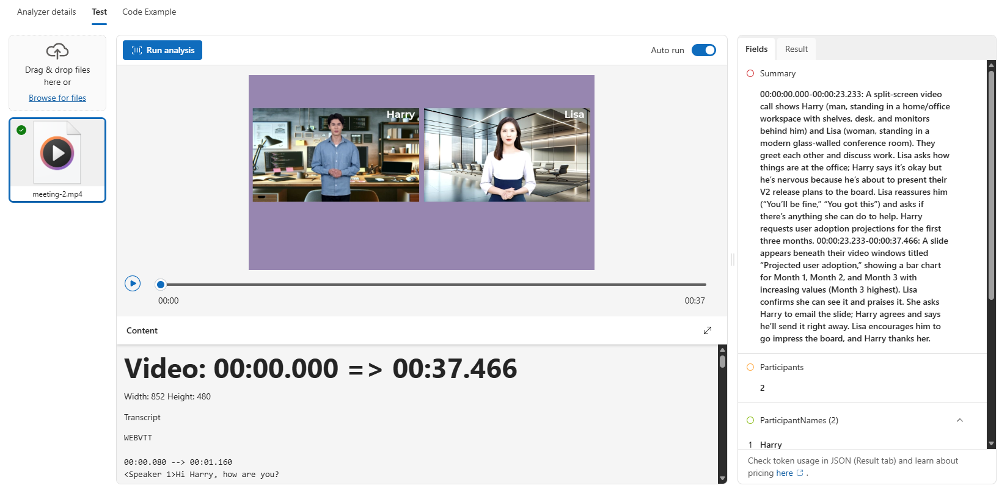

# Lab 02 - Extract Information from Multimodal Content

Source exercise: https://microsoftlearning.github.io/mslearn-ai-information-extraction/Instructions/Exercises/01-content-understanding.html

Source lab files: https://github.com/MicrosoftLearning/mslearn-ai-information-extraction/tree/main/Labfiles/content

In this lab, you use Azure AI Content Understanding to extract information from documents, images, audio, and video. The Microsoft Learn source exercise is mostly a portal follow-along experience. This workshop keeps that portal flow and adds a second optional folder that shows how to create and call a custom analyzer with the Python SDK.

This workshop structure is slightly different from the source repo:

- The multimodal portal assets are downloaded into `workshop/lab-02-content-understanding/01-multimodal-content/`.
- The Python SDK business-card analyzer files are in `workshop/lab-02-content-understanding/02-create-analyzers-python-sdk/`.
- The only Python requirements file is `workshop/requirements.txt`.
- The only environment file is `workshop/.env`.
- The `.env` file should be copied from `workshop/.env.sample` because `.env` is intentionally gitignored.

You will first explore prebuilt analyzers in Microsoft Foundry, then create custom analyzers in Content Understanding Studio for invoice, slide image, voicemail audio, and meeting video content. At the end, you can optionally run the Python SDK business-card analyzer flow.

## Estimated Time

Plan for **2.5-3 hours** to complete the full lab. The estimate includes Foundry setup, prebuilt analyzer review, four custom analyzer build-and-test cycles, and the optional Python SDK business-card analyzer flow. If you skip the optional SDK section, plan for about **2-2.5 hours**.

## Learning Objectives

After completing this lab, you will be able to:

- Create or reuse a Microsoft Foundry project for Azure AI Content Understanding.
- Download and use the Microsoft Learn multimodal content assets locally.
- Try prebuilt Content Understanding analyzers in Microsoft Foundry.
- Create custom analyzer projects in Content Understanding Studio.
- Define schemas for document, image, audio, and video extraction.
- Build reusable analyzers and test them with new files.
- Optionally create and call a custom analyzer from Python.

## Prerequisites

Before you start, complete the workshop setup and make sure you have:

- An Azure subscription.
- Azure CLI installed and signed in.
- Permission to create or use a Microsoft Foundry resource and project.
- Permission to deploy or use the models required by Content Understanding.
- Python 3.10 through 3.13 if you plan to run the optional SDK section.
- The dependencies from `workshop/requirements.txt` installed if you plan to run the optional SDK section.

Create and activate a Python virtual environment from the repository root only if you plan to run the optional SDK section:

```powershell
py -3.13 -m venv .venv
.\.venv\Scripts\Activate.ps1
python -m pip install --upgrade pip
python -m pip install -r workshop/requirements.txt
```

If you are using Bash, use these equivalent commands:

```bash
python3 -m venv .venv
source .venv/bin/activate
python -m pip install --upgrade pip
python -m pip install -r workshop/requirements.txt
```

Create your local environment file from the sample if you have not already done so:

```powershell
Copy-Item workshop/.env.sample workshop/.env
```

If you are using Bash, use this equivalent command:

```bash
cp workshop/.env.sample workshop/.env
```

Sign in to Azure:

```powershell
az login
```

## 1. Prepare the Lab Folder

From the repository root, confirm the lab has this structure:

```text
workshop/
	lab-00-setup/
		README.md
	.env.sample
	.env
	requirements.txt
	lab-02-content-understanding/
		README.md
		01-multimodal-content/
		02-create-analyzers-python-sdk/
			biz-card.json
			biz-card-1.png
			biz-card-2.png
			create-analyzer.ipynb
			create-analyzer.py
			read-card.ipynb
			read-card.py
```

The `01-multimodal-content/` folder is where you will download and extract the source exercise data. The downloaded zip file and extracted `content/` folder are gitignored because they are workshop input artifacts and can be large.

## 2. Download the Source Exercise Content

The Microsoft Learn source exercise uses a `content.zip` package that contains the document, image, audio, and video files for the portal walkthrough. Download it as `workshop/lab-02-content-understanding/01-multimodal-content/content.zip` and extract it to `workshop/lab-02-content-understanding/01-multimodal-content/content/`.

From the repository root, run:

```powershell
$labPath = "workshop/lab-02-content-understanding/01-multimodal-content"
$zipPath = "$labPath/content.zip"
$contentPath = "$labPath/content"

Invoke-WebRequest `
	-Uri "https://github.com/MicrosoftLearning/mslearn-ai-information-extraction/raw/main/Labfiles/content/content.zip" `
	-OutFile $zipPath

Expand-Archive -Path $zipPath -DestinationPath $contentPath -Force
```

If you are using Bash, use these equivalent commands:

```bash
lab_path="workshop/lab-02-content-understanding/01-multimodal-content"
curl -L "https://github.com/MicrosoftLearning/mslearn-ai-information-extraction/raw/main/Labfiles/content/content.zip" -o "$lab_path/content.zip"
rm -rf "$lab_path/content"
unzip "$lab_path/content.zip" -d "$lab_path/content"
```

After extraction, confirm that the folder contains files such as `invoice-1234.pdf`, `invoice-1235.pdf`, `slide-1.jpg`, `slide-2.jpg`, `call-1.mp3`, `call-2.mp3`, `meeting-1.mp4`, and `meeting-2.mp4`.

<details>
<summary>Checkpoint: downloaded content location</summary>

Your lab folder should now include these downloaded files. They should remain local and should not be committed:

```text
workshop/
	lab-02-content-understanding/
		01-multimodal-content/
			content.zip
			content/
				invoice-1234.pdf
				invoice-1235.pdf
				slide-1.jpg
				slide-2.jpg
				call-1.mp3
				call-2.mp3
				meeting-1.mp4
				meeting-2.mp4
```

</details>

## 3. Create a Microsoft Foundry Resource and Project

The features used in this lab require a Microsoft Foundry resource and project.

1. Open the [Microsoft Foundry portal](https://ai.azure.com/) at `https://ai.azure.com`.
2. Sign in with your Azure account.
3. Make sure the **New Foundry** toggle is on if the portal shows one.
4. If you are not prompted to create a project, select the project name in the upper-left corner, then select **Create new project**.
5. Enter a project name.
6. Expand **Advanced options**.
7. Use the default Foundry resource, or create a new one.
8. Choose a region that supports Azure Content Understanding. Check the [Content Understanding region support documentation](https://learn.microsoft.com/azure/ai-services/content-understanding/language-region-support) for the latest list.
9. Select your subscription and resource group.
10. Select **Create** and wait for the project to finish deploying.

Content Understanding custom analyzers may require model deployments such as `gpt-4.1`, `gpt-4.1-mini`, and `text-embedding-3-large`. If the portal or Content Understanding Studio offers an option to autodeploy required models, leave it enabled.

## 4. Try Prebuilt Analyzers in Microsoft Foundry

Before creating custom analyzers, try the prebuilt Content Understanding analyzers in Foundry. This shows the difference between general extraction and schema-specific custom extraction.

1. In the [Microsoft Foundry portal](https://ai.azure.com/), select **Build** in the upper-right menu.
2. Select **Deployments** in the left pane.
3. Select the **AI Services** tab.
4. Find and select **Azure Content Understanding - Layout**.
5. In the Layout analyzer playground, choose the option to upload your own data.
6. Upload `workshop/lab-02-content-understanding/01-multimodal-content/content/invoice-1234.pdf`.
7. Run the analyzer and wait for analysis to complete.
8. Review the formatted result and the raw JSON result.
9. Notice that the Layout analyzer extracts text, tables, and document structure, but does not extract custom fields such as invoice totals or vendor names.
10. Return to the **AI Services** tab and optionally try **Azure Content Understanding - Read** with the same file to compare the result.

<details>
<summary>Checkpoint: what to notice in the prebuilt analyzer output</summary>

The prebuilt Layout analyzer should identify invoice text, tables, paragraphs, and structural metadata. The optional Read analyzer focuses more narrowly on readable text.

These prebuilt analyzers are useful for general content extraction. The custom analyzer projects in the next sections add schema-specific fields for invoices, slides, voicemail audio, and meeting video.

</details>

## 5. Set Up Content Understanding Studio

Custom analyzers are created in Content Understanding Studio.

1. Open [Content Understanding Studio](https://contentunderstanding.ai.azure.com/) at `https://contentunderstanding.ai.azure.com`.
2. Sign in with the same Azure account you used in Foundry.
3. If prompted to set up a resource or on the **Settings** page, select **Add resource** button.
4. Select the Foundry resource you created or reused.
5. Select **Next**, then **Save**.
6. If an option appears to autodeploy required models, leave it enabled.
7. Select **Content Understanding** in the top navigation to return to the home page.

## 6. Extract Information from Invoice Documents

In this section, you create a custom analyzer for invoice PDFs.

### Create Storage Account

Content Understanding Studio requires an Azure Blob Storage account to store the data used for building custom analyzers. Create the storage account in the same resource group as your Foundry resource.

> NOTE: You could also use the same Storage Account created in Lab 01

1. In a new browser tab, open the [Azure portal](https://portal.azure.com/) at `https://portal.azure.com` and sign in with your Azure credentials.
2. Select **+ Create a resource**, search for `Storage account`, and create a new **Storage account** resource with the following settings:

| Setting | Value |
| --- | --- |
| Subscription | Your Azure subscription |
| Resource group | The same resource group as your Foundry resource |
| Storage account name | Enter a globally unique name |
| Region | The same region as your Foundry resource |
| Preferred storage type | Azure Blob Storage or Azure Data Lake Storage Gen2 |
| Performance | Standard |
| Redundancy | Locally-redundant storage (LRS) |

3. Select **Review + create**, and then **Create**. Wait for deployment to complete.

### Create the Invoice Project

1. In Content Understanding Studio, select **Get started** in the custom projects section, then select **Create**.
2. Select **Extract content and fields with a custom schema**.
3. Use these project settings:

| Setting | Value |
| --- | --- |
| Project name | `Invoice analysis` |
| Description | `Extract data from an invoice` |
| Connected resource | Your Foundry resource |
| Storage account | Create or select a storage account connected to the project |
| Blob container | Create or select a container such as `content-understanding` |

4. Wait for the project to be created.
5. Upload `workshop/lab-02-content-understanding/01-multimodal-content/content/invoice-1234.pdf`.
6. When prompted to choose a template, select **Invoice** and save it. 

    The Invoice template includes common fields that are found in invoices. You can use the schema editor to delete any of the suggested fields that you don’t need, and add any custom fields that you do.

If you see a storage access error, wait a minute and try again. New storage permissions can take a short time to propagate.

### Define the Invoice Schema

1. Review the suggested invoice fields.
2. Delete fields you do not need, such as `BillingAddress`, if it does not apply to the uploaded invoice.
3. Select **Suggest** to let Content Understanding recommend fields from the uploaded invoice.
4. Review the suggested fields and save the schema.
5. Add this field if it is not already present:

| Field | Description | Type | Method |
| --- | --- | --- | --- |
| `TotalQuantity` | Total number of items on the invoice | String | Auto |

6. Save the schema.
7. Select the **Test** tab.
8. Select **Run analysis** and wait for analysis to complete.
9. Review the extracted fields in the **Fields** pane and the raw response in the **Results** pane.

### Build and Test the Invoice Analyzer

1. Select **Build analyzer**.
2. Use these analyzer settings:

| Setting | Value |
| --- | --- |
| Name | `invoiceanalyzer` |
| Description | `Invoice analyzer` |

3. Build the analyzer.
4. Select **Jump to analyzer list**.
5. Open `invoiceanalyzer`.
6. Select the **Test** tab.
7. Upload `workshop/lab-02-content-understanding/01-multimodal-content/content/invoice-1235.pdf`.
8. Run the analysis.
9. Review the **Fields** pane and **Results** pane.

<details>
<summary>Solution: invoice analyzer schema targets</summary>

Your exact schema can vary, but a useful invoice analyzer should extract common fields such as:



The important checkpoint is that `invoice-1235.pdf` can be analyzed by the built `invoiceanalyzer` and returns structured field values in the **Fields** pane.

</details>

## 7. Extract Information from a Slide Image

In this section, you create a custom analyzer for a slide image that contains charts.

### Define the Slide Schema

1. Return to the Content Understanding project list.
2. Select **Create**.
3. Select **Extract content and fields with a custom schema**.
4. Use these project settings:

| Setting | Value |
| --- | --- |
| Project name | `Slide analysis` |
| Description | `Extract data from an image of a slide` |
| Advanced settings | Use the same connected resource and storage settings as the invoice project |

5. Upload `workshop/lab-02-content-understanding/01-multimodal-content/content/slide-1.jpg`.
6. Select the **Image analysis** template and save it.
7. Add these top-level fields:

| Field | Description | Type | Method |
| --- | --- | --- | --- |
| `Title` | Slide title | String | Generate |
| `Summary` | Summary of the slide | String | Generate |
| `Charts` | Number of charts on the slide | Integer | Generate |

8. Add a `QuarterlyRevenue` field with type **List of objects** and these subfields:

| Subfield | Description | Type | Method |
| --- | --- | --- | --- |
| `Quarter` | Which quarter? | String | Generate |
| `Revenue` | Revenue for the quarter | Number | Generate |

9. Add a `ProductCategories` field with type **List of objects** and these subfields:

| Subfield | Description | Type | Method |
| --- | --- | --- | --- |
| `ProductCategory` | Product category name | String | Generate |
| `RevenuePercentage` | Percentage of revenue | Number | Generate |

10. Save the schema.
11. Select the **Test** tab.
12. Run analysis and review the extracted fields.

### Build and Test the Slide Analyzer

1. Select **Build analyzer**.
2. Use these analyzer settings:

| Setting | Value |
| --- | --- |
| Name | `slideanalyzer` |
| Description | `Slide image analyzer` |

3. Build the analyzer.
4. Open `slideanalyzer` from the analyzer list.
5. Select the **Test** tab.
6. Upload `workshop/lab-02-content-understanding/01-multimodal-content/content/slide-2.jpg`.
7. Run the analysis.
8. Review the fields and raw JSON response.

<details>
<summary>Checkpoint: slide analyzer behavior</summary>

The analyzer should extract a title, summary, chart count, and quarterly revenue values. `slide-2.jpg` may not include every category breakdown, so missing `ProductCategories` values can be expected depending on the image content.



</details>

## 8. Extract Information from a Voicemail Audio Recording

In this section, you create a custom analyzer for voicemail audio.

### Define the Audio Schema

1. Return to the Content Understanding project list.
2. Select **Create**.
3. Select **Extract content and fields with a custom schema**.
4. Use these project settings:

| Setting | Value |
| --- | --- |
| Project name | `Voicemail analysis` |
| Description | `Extract data from a voicemail recording` |
| Advanced settings | Use the same connected resource and storage settings as the previous projects |

5. Upload `workshop/lab-02-content-understanding/01-multimodal-content/content/call-1.mp3`.
6. Select the **Audio analysis** template and save it.
7. In the content pane, select **Get transcription preview**.
8. Add these fields:

| Field | Description | Type | Method |
| --- | --- | --- | --- |
| `Caller` | Person who left the message | String | Generate |
| `Summary` | Summary of the message | String | Generate |
| `Actions` | Requested actions | String | Generate |
| `CallbackNumber` | Telephone number to return the call | String | Generate |
| `AlternativeContacts` | Alternative contact details | List of strings | Generate |

9. Run analysis and wait for completion. Audio analysis can take several minutes.
10. Review the extracted fields and expand `AlternativeContacts` if values are returned.

### Build and Test the Audio Analyzer

1. Select **Build analyzer**.
2. Use these analyzer settings:

| Setting | Value |
| --- | --- |
| Name | `voicemailanalyzer` |
| Description | `Voicemail audio analyzer` |

3. Build the analyzer.
4. Open `voicemailanalyzer` from the analyzer list.
5. Select the **Test** tab.
6. Upload `workshop/lab-02-content-understanding/01-multimodal-content/content/call-2.mp3`.
7. Run the analysis.
8. Review the fields and raw JSON response.

<details>
<summary>Checkpoint: voicemail analyzer behavior</summary>

The analyzer should extract who called, a short summary, requested actions, callback number, and any alternative contact details mentioned in the voicemail.



</details>

## 9. Extract Information from a Video Conference Recording

In this section, you create a custom analyzer for a meeting video.

### Define the Video Schema

1. Return to the Content Understanding project list.
2. Select **Create**.
3. Select **Extract content and fields with a custom schema**.
4. Use these project settings:

| Setting | Value |
| --- | --- |
| Project name | `Conference call video analysis` |
| Description | `Extract data from a video conference recording` |
| Advanced settings | Use the same connected resource and storage settings as the previous projects |

5. Upload `workshop/lab-02-content-understanding/01-multimodal-content/content/meeting-1.mp4`.
6. Select the **Video analysis** template.
7. In the content pane, select **Get transcription preview**.
8. Add these fields:

| Field | Description | Type | Method |
| --- | --- | --- | --- |
| `Summary` | Summary of the discussion | String | Generate |
| `Participants` | Count of meeting participants | Integer | Generate |
| `ParticipantNames` | Names of meeting participants | List of strings | Generate |
| `SharedSlides` | Descriptions of any PowerPoint slides presented | List of strings | Generate |
| `AssignedActions` | Tasks assigned to participants | List of objects | Generate |

9. For `AssignedActions`, add these subfields:

| Subfield | Description | Type | Method |
| --- | --- | --- | --- |
| `Task` | Description of the task | String | Generate |
| `AssignedTo` | Who the task is assigned to | String | Generate |

10. Save the schema.
11. Run analysis and wait for completion. Video analysis can take several minutes.
12. Review the extracted fields.

### Build and Test the Video Analyzer

1. Select **Build analyzer**.
2. Use these analyzer settings:

| Setting | Value |
| --- | --- |
| Name | `meetinganalyzer` |
| Description | `Meeting video analyzer` |

3. Build the analyzer and wait until it is ready.
4. Open `meetinganalyzer` from the analyzer list.
5. Select the **Test** tab.
6. Upload `workshop/lab-02-content-understanding/01-multimodal-content/content/meeting-2.mp4`.
7. Run the analysis.
8. Review the extracted fields for each segment or shot and inspect the raw JSON response.

<details>
<summary>Checkpoint: meeting analyzer behavior</summary>

The analyzer should extract a meeting summary, participant count, participant names, descriptions of shared slides, and assigned actions with the person responsible for each task.



</details>

## 10. Configure the Python SDK Business Card Analyzer

The second folder, `02-create-analyzers-python-sdk/`, shows how to create and call a custom Content Understanding analyzer from Python. This is separate from the portal-led multimodal flow above.

1. Open `workshop/.env` and update the Content Understanding values:

```env
CONTENT_UNDERSTANDING_ENDPOINT=<your-content-understanding-endpoint>
CONTENT_UNDERSTANDING_KEY=<your-content-understanding-key-or-leave-empty-for-current-user-credentials>
ANALYZER_NAME=bizcardanalyzer
```

If `CONTENT_UNDERSTANDING_KEY` is empty, the scripts use your current Azure credential through `DefaultAzureCredential`. If you provide a key, the scripts use `AzureKeyCredential`.

2. Open `workshop/lab-02-content-understanding/02-create-analyzers-python-sdk/biz-card.json`. The schema extracts these fields from business card images:

- `Company`
- `Name`
- `Title`
- `Email`
- `Phone`

<details>
<summary>Solution: shared environment file format</summary>

Your `workshop/.env` should include the lab-02 settings below. The key can be a real key or left empty when you use current user credentials:

```env
#################################
# Lab 2 - Content Understanding #
#################################

CONTENT_UNDERSTANDING_ENDPOINT=https://<resource-name>.services.ai.azure.com/
CONTENT_UNDERSTANDING_KEY=
ANALYZER_NAME=bizcardanalyzer
```

If your resource shows a different endpoint format in the Azure portal or Foundry portal, use the endpoint shown for your resource.

</details>

## 11. Create the Business Card Analyzer with Python

From the repository root, run:

```powershell
python workshop/lab-02-content-understanding/02-create-analyzers-python-sdk/create-analyzer.py
```

If you prefer to run the analyzer creation step by step, open `workshop/lab-02-content-understanding/02-create-analyzers-python-sdk/create-analyzer.ipynb` and run the cells from top to bottom.

Wait for the long-running analyzer creation operation to finish. If you run the script again with the same `ANALYZER_NAME`, the script replaces the existing analyzer because `allow_replace=True` is used.

<details>
<summary>Solution: completed analyzer creation script</summary>

```python
from pathlib import Path
import json
import os

from azure.ai.contentunderstanding import ContentUnderstandingClient
from azure.core.credentials import AzureKeyCredential
from azure.identity import DefaultAzureCredential
from dotenv import load_dotenv


def optional_setting(name: str) -> str:
	value = (os.getenv(name) or "").strip()
	return "" if not value or value.startswith("<") else value


def require_setting(name: str) -> str:
	value = optional_setting(name)
	if not value:
		raise ValueError(f"Set {name} in workshop/.env")
	return value


def get_credential():
	key = optional_setting("CONTENT_UNDERSTANDING_KEY")
	return AzureKeyCredential(key) if key else DefaultAzureCredential()


def main():
	os.system('cls' if os.name=='nt' else 'clear')

	try:
		script_dir = Path(__file__).resolve().parent
		env_path = script_dir.parents[1] / ".env"
		schema_path = script_dir / "biz-card.json"

		with schema_path.open("r", encoding="utf-8") as file:
			schema_json = json.load(file)

		load_dotenv(env_path)
		ai_svc_endpoint = require_setting('CONTENT_UNDERSTANDING_ENDPOINT')
		analyzer = require_setting('ANALYZER_NAME')

		create_analyzer(schema_json, analyzer, ai_svc_endpoint)

		print("\n")

	except Exception as ex:
		print(ex)


def create_analyzer(schema, analyzer, endpoint):
	print(f"Creating {analyzer}")

	client = ContentUnderstandingClient(
		endpoint=endpoint,
		credential=get_credential()
	)

	poller = client.begin_create_analyzer(
		analyzer_id=analyzer,
		resource=schema,
		allow_replace=True
	)

	result = poller.result()
	print(f"Analyzer '{analyzer}' created successfully.")
	print(f"Status: {result['status'] if isinstance(result, dict) else 'Succeeded'}")


if __name__ == "__main__":
	main()
```

</details>

## 12. Analyze Business Cards with Python

Analyze the first business card:

```powershell
python workshop/lab-02-content-understanding/02-create-analyzers-python-sdk/read-card.py
```

Analyze the second business card:

```powershell
python workshop/lab-02-content-understanding/02-create-analyzers-python-sdk/read-card.py biz-card-2.png
```

If you prefer to analyze the cards step by step, open `workshop/lab-02-content-understanding/02-create-analyzers-python-sdk/read-card.ipynb` and run the cells from top to bottom. To analyze the second card, update the image selection cell in the notebook to use `second_card_path`, then rerun the analysis cells.

Review the extracted field values in the terminal. Open `workshop/lab-02-content-understanding/02-create-analyzers-python-sdk/results.json` to inspect the full JSON response.

<details>
<summary>Solution: completed business card analysis script</summary>

```python
from pathlib import Path
import json
import os
import sys

from azure.ai.contentunderstanding import ContentUnderstandingClient
from azure.core.credentials import AzureKeyCredential
from azure.identity import DefaultAzureCredential
from dotenv import load_dotenv


def optional_setting(name: str) -> str:
	value = (os.getenv(name) or "").strip()
	return "" if not value or value.startswith("<") else value


def require_setting(name: str) -> str:
	value = optional_setting(name)
	if not value:
		raise ValueError(f"Set {name} in workshop/.env")
	return value


def get_credential():
	key = optional_setting("CONTENT_UNDERSTANDING_KEY")
	return AzureKeyCredential(key) if key else DefaultAzureCredential()


def main():
	os.system('cls' if os.name=='nt' else 'clear')

	try:
		script_dir = Path(__file__).resolve().parent
		env_path = script_dir.parents[1] / ".env"

		image_file = script_dir / 'biz-card-1.png'
		if len(sys.argv) > 1:
			image_file = Path(sys.argv[1])
			if not image_file.is_absolute():
				image_file = script_dir / image_file

		load_dotenv(env_path)
		ai_svc_endpoint = require_setting('CONTENT_UNDERSTANDING_ENDPOINT')
		analyzer = require_setting('ANALYZER_NAME')

		analyze_card(image_file, analyzer, ai_svc_endpoint)

		print("\n")

	except Exception as ex:
		print(ex)


def analyze_card(image_file, analyzer, endpoint):
	print(f"Analyzing {image_file.name}")

	client = ContentUnderstandingClient(
		endpoint=endpoint,
		credential=get_credential()
	)

	image_data = image_file.read_bytes()

	print("Submitting request...")
	poller = client.begin_analyze_binary(
		analyzer_id=analyzer,
		binary_input=image_data,
		content_type="image/png"
	)

	result = poller.result()
	print("Analysis succeeded:\n")

	output_file = image_file.parent / "results.json"
	with output_file.open("w", encoding="utf-8") as json_file:
		json.dump(dict(result), json_file, indent=4, default=str)
		print(f"Response saved in {output_file}\n")

	for content in result.contents:
		if hasattr(content, 'fields') and content.fields:
			for field_name, field_data in content.fields.items():
				value = field_data.value if hasattr(field_data, 'value') else None
				print(f"{field_name}: {value}")


if __name__ == "__main__":
	main()
```

</details>

<details>
<summary>Checkpoint: what successful business card analysis looks like</summary>

The exact values depend on the sample image and service version, but successful output should look similar to this:

```text
Analyzing biz-card-1.png
Submitting request...
Analysis succeeded.

Response saved in C:\...\workshop\lab-02-content-understanding\02-create-analyzers-python-sdk\results.json

Company: ...
Name: ...
Title: ...
Email: ...
Phone: ...
```

</details>

## Troubleshooting

If the portal cannot create a custom analyzer, confirm that your Foundry resource is in a Content Understanding supported region and has the required model deployments available.

If the portal cannot access storage, wait a minute and retry. New storage and model permissions can take a short time to propagate.

If audio or video analysis takes longer than document or image analysis, continue waiting. Multimodal transcription and segment analysis can take several minutes.

If `ModuleNotFoundError: No module named 'azure.ai.contentunderstanding'` appears in the optional SDK section, activate `.venv` and reinstall the shared requirements:

```powershell
python -m pip install -r workshop/requirements.txt
```

If SDK authentication fails and `CONTENT_UNDERSTANDING_KEY` is empty, run `az login` again and confirm your Azure user has access to the Foundry or Content Understanding resource.

If the SDK analyzer is not found, run `create-analyzer.py` first and confirm that `ANALYZER_NAME` is the same in both runs.

## Clean Up

When you are finished, remove any Azure resources you created only for this lab to avoid ongoing charges. If you used a shared workshop resource, leave it in place for the remaining labs.
